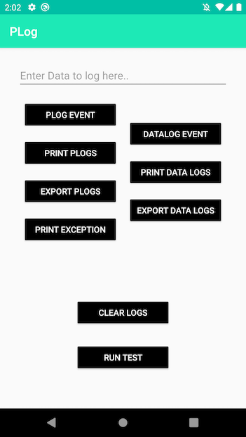

# RxLogs Advanced Logging
[]( https://android-arsenal.com/details/1/6633 )
### PLog and DataLog (Loggers)
##### `A file based advanced logging framework written in Kotlin`.

[](https://jitpack.io/#umair13adil/RxLogs)

Overview
--------

All logs are saved to files in storage path provided. These logs are helpful when developer wants to analyze user activities within the app. A new log file is created every hour on a user event. These logs can be filtered and sorted easily. Logs can easily be exported as zip file base on filter type. This zip file can be uploaded to server on export. PLogs also provide functionality to log arrange data logs into a predefined directory structure. These logs can be used for a specific event within the app.




Features
--------

1. Logs events in files created separately every hour with **'PLogs'** logger. (24 hours)
2. Files can be compressed and exported for time and day filters
3. Clear Logs easily
4. Save logs to custom path
5. Export Logs to custom path as zip file
6. RxJava2 support
7. Custom Log formatting
8. CSV support
9. Custom timestamps support
10. Custom data logging support with **'DataLogs'** logger.
11. Encryption support added
12. Auto Log system crashes
13. Multiple directory structures
14. Print logs as String
15. Export all or single types of logs
16. XML configuration support for internal persistence
17. Logger events Subscription
18. Advanced Automation for deleting logs automatically
19. Exports HTML formatted exceptions

Prerequisites
-------------

Logging is done on storage directory so it's very important to add these permissions to your project's manifest file first.

```xml
<uses-permission android:name="android.permission.WRITE_EXTERNAL_STORAGE"/>
<uses-permission android:name="android.permission.READ_EXTERNAL_STORAGE"/>
```

**Check for Runtime permissions:**

```kotlin
        if (ContextCompat.checkSelfPermission(this, Manifest.permission.READ_EXTERNAL_STORAGE) != PackageManager.PERMISSION_GRANTED
                || ContextCompat.checkSelfPermission(this, Manifest.permission.WRITE_EXTERNAL_STORAGE) != PackageManager.PERMISSION_GRANTED) {

            ActivityCompat.requestPermissions(this, arrayOf(Manifest.permission.READ_EXTERNAL_STORAGE, Manifest.permission.WRITE_EXTERNAL_STORAGE), YOUR_PERMISSION_CODE)
            return //Don't initialize logger if permissions are not granted
        }
```


Setup
-------------

Add module to your project:

## Step 1. Add the JitPack repository to your build file

Add it in your root build.gradle at the end of repositories:
```groovy
allprojects {
  repositories {
    maven { url 'https://jitpack.io' }
 }
}
```
## Step 2. Add the dependency

```groovy
dependencies {
   implementation 'com.github.umair13adil:RxLogs:0.17'
}
```
    
Usage
-------------

Add following implementation in your Application class.

```kotlin
class MainApplication : Application() {
    
        override fun onCreate() {
            super.onCreate()
    
            setUpPLogger() //Initialize PLogger here
        }

private fun setUpPLogger() {
             val logsPath = Environment.getExternalStorageDirectory().absolutePath + File.separator + "PLogs"
             
                     val logsConfig = LogsConfig(
                             isDebuggable = true,
                             savePath = logsPath,
                             zipFileName = "MyLogs",
                             exportPath = logsPath + File.separator + "PLogsOutput"
                     )

                     PLog.applyConfigurations(logsConfig, saveToFile = true) //Initialize configurations
                   
         }
}
```
                
#### To Log data to file simply call like this
_______________________________________________

**1. Simple Info Log**

```kotlin
    PLog.logThis(TAG, "method_name", "Log: " + Math.random(), LogLevel.INFO)
```

**2. Simple Warning Log**

```kotlin
    PLog.logThis(TAG, "method_name", "This is a warning message!", LogLevel.WARNING)
```

**3. Error Log**

```kotlin
    PLog.logThis(TAG, "method_name", "This is a error message!", LogLevel.ERROR)
```

**4. Severe Log**

```kotlin
    PLog.logThis(TAG, "method_name", "This is a severe error message!", LogLevel.SEVERE)
```

**5. Exception Log**

```kotlin
    PLog.logThis(TAG, "reportError", Exception("This is an Exception!"))
```

**6. Throwable Log**

```kotlin
    PLog.logThis(TAG, "reportError", Throwable("This is an Throwable!"))
```

**7. Exception Log with Info**

```kotlin
    PLog.logThis(TAG, "reportError", info = "Some Info", exception = Exception("This is an Exception!"), level =  LogLevel.ERROR)
```

**8. Throwable Log with Info**

```kotlin
    PLog.logThis(TAG, "reportError", info = "Some Info", throwable = Throwable("This is an Exception!"), level =  LogLevel.SEVERE)
```

Wiki
--------

Checkout [Wiki](https://github.com/umair13adil/RxLogs/wiki) for more information.

Change Log
----------

###### Version: 0.17
- **'autoClearLogs'** parameter in logs configuration changed to **'autoDeleteZipOnExport'**
- Added **'autoClearLogs'** parameter in logs configuration to enable/disable **'Auto Clear Logs'** feature
- Added **'context'** parameter in logs configuration to enable **'HTML formatted Logs in case of exceptions'**
- Added **'Log Events'** for formatted exceptions output
    * EventTypes.NEW_ERROR_REPORTED_FORMATTED
    * EventTypes.SEVERE_ERROR_REPORTED_FORMATTED
- Changed **'type: LogLevel'** parameter in **'logThis()'** function to **'level: LogLevel'**

## MIT License

##### Copyright (c) 2018 Muhammad Umair Adil

Permission is hereby granted, free of charge, to any person obtaining a copy of this software and associated documentation files (the "Software"), to deal in the Software without restriction, including without limitation the rights to use, copy, modify, merge, publish, distribute, sublicense, and/or sell copies of the Software, and to permit persons to whom the Software is furnished to do so, subject to the following conditions:

The above copyright notice and this permission notice shall be included in all copies or substantial portions of the Software.

THE SOFTWARE IS PROVIDED "AS IS", WITHOUT WARRANTY OF ANY KIND, EXPRESS OR IMPLIED, INCLUDING BUT NOT LIMITED TO THE WARRANTIES OF MERCHANTABILITY, FITNESS FOR A PARTICULAR PURPOSE AND NONINFRINGEMENT. IN NO EVENT SHALL THE AUTHORS OR COPYRIGHT HOLDERS BE LIABLE FOR ANY CLAIM, DAMAGES OR OTHER LIABILITY, WHETHER IN AN ACTION OF CONTRACT, TORT OR OTHERWISE, ARISING FROM, OUT OF OR IN CONNECTION WITH THE SOFTWARE OR THE USE OR OTHER DEALINGS IN THE SOFTWARE.
